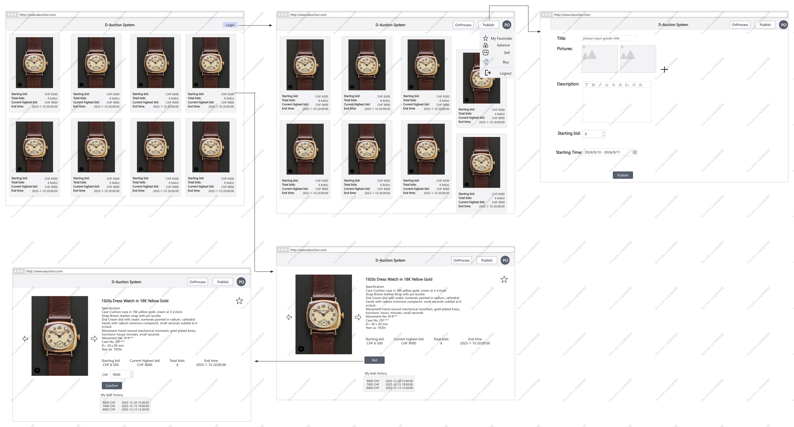

# DAPP

## APP theme：Auction System
1. User Registration and Identity
2. Auction Creation
    Include details like:
    * Item description.
    * Starting price.
    * Auction duration (start and end times).
    * Reserve price (optional minimum acceptable price).
3. Bidding  
    * Place Bid:
        * Allow users to submit bids higher than the current bid.
    * Track Highest Bid:
        * Ensure the highest bid is updated in real time.
    * Refund Outbid Users:
        * Automatically return funds (or placeholders) to bidders who were outbid.
    * Bid History (Optional):
        * Display a list of all bids for transparency.
4. Auction Lifecycle Management
    * Start Auction:
        * Activate an auction at the specified start time.
    * End Auction:
        * Automatically or manually close the auction when the duration ends.
        * Determine the winner (highest bidder).
        * Handle unsold items if no bids meet the reserve price.
5. Payments and Funds Management
    * ~~Escrow System:~~
        * ~~Lock the highest bid funds during the auction.~~
        * ~~Hold funds until the auction is successfully completed.~~
    * Transfer Funds:
        * Release funds to the seller after the auction ends.
    * Refund Mechanism:
        * Refund all other bidders except the highest one.
    * Fees (Optional):
        * Deduct platform or transaction fees if applicable.

## Prototype 

## project structure
**contracts**: smart contract code

**frontend**：frontend code

**scripts**: smart contract code deploying scripts

**hardhat.config.js**: framework for compiling, testing and deploying on a local

**package.json**: package management / project config

**others**: compiling / running artifacts

## Develop progress：

## 开发规则：
1. 代码不要直接合并到main分支，应该合并到dev
2. 可以从dev分支拉个自己的分支
3. 先pull,本地解决完冲突，自己验证通过，再push到远程

